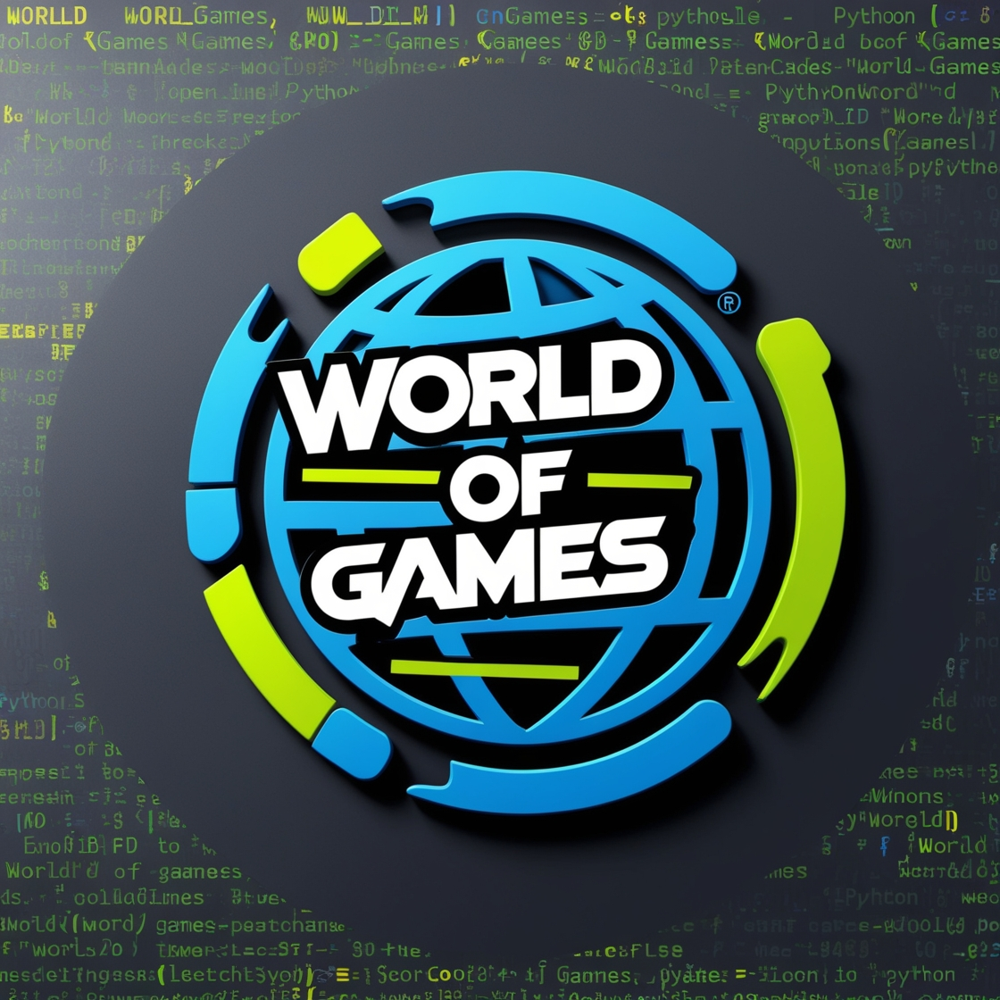

<!DOCTYPE html>
<html lang="en">

 

<body>
<h1> World of Games </h1>

Welcome to the <strong>World of Games</strong> project! This document is a developer's guide to understanding, setting up, and contributing to the project. The game is written in Python and includes several modules to interact with the user through the terminal as well as a web-based interface to serve scores. The project uses Docker to containerize the web service for score publishing and testing.

<h2>Project Overview</h2>
    
World of Games is a terminal-based Python game with different mini-games. Players are challenged in various games like "Guess Game," "Currency Roulette," and "Memory Game." Scores are stored in a file, and a Flask web application is used to serve these scores, allowing users to view the game results via the web.

<h3>Project Structure</h3>

<pre>
    /wog
    ├── Dockerfile                # Dockerfile to build the Python environment and web service
    ├── docker-compose.yml        # Docker Compose configuration for the application
    ├── Jenkinsfile               # Jenkins pipeline configuration file
    ├── app.py                    # Main entry point for the game logic (called by main.py)
    ├── main.py                   # Main entry point for the welcome screen and initiates the game (calls app.py)
    ├── requirements.txt          # Python dependencies for the application
    ├── games/                    # Python game modules (located here)
    │   ├── guess_game.py         # Game logic for the Guess Game
    │   ├── currency_roulette.py  # Game logic for the Currency Roulette game
    │   └── memory_game.py        # Game logic for the Memory game
    ├── images/                   # Folder for image assets (e.g., logos)
    ├── templates/                # HTML templates for the web service
    ├── tests/                    # Test suite for the application
    │   └── e2e.py                # Selenium-based tests for the web service
    ├── utilities/                # Utility scripts and main game logic
    │   ├── main_score.py         # Entry point for the Flask web service
    │   ├── utils.py              # Utility functions for the game logic
    └── README.md                 # This developer's guide (Markdown format)
</pre>
<h3>Game Modules </h3>

Guess Game:
The Guess Game module is designed to initiate a new game by generating a random number
within a specified range of 0 to a variable named difficulty. The game involves receiving a number
input from the player based on the provided properties.

Currency Roulette Game:
The Currency Roulette Game module utilizes a free currency API(package) to retrieve the current
exchange rate from USD to ILS (Israeli Shekel). Players are tasked with guessing the value of a newly
generated random number (between 1 and 100) in USD converted to ILS. The accuracy of their guess
depends on the game's difficulty level.

Memory Game:
The Memory Game module aims to challenge players' memory by displaying a sequence of
random numbers (for example if the difficulty is 3 the random numbers can be: 100, 15, 80) for a
brief duration (0.7 seconds) and then prompting them to recall and input the displayed numbers.
The objective is to determine whether the player's input matches the original sequence.

<h2>Setup and Installation</h2>
    
Follow these steps to set up the project locally for development or testing purposes:

    <ul>
        <li>Clone the repository: <code>git clone https://github.com/YAACOV2008/wog.git</code></li>
        <li>Navigate to the project directory: <code>cd wog</code></li>
        <li>Build and start the application with Docker Compose:
            <pre>docker-compose up --build</pre>
        </li>
    </ul>
    
This will automatically build the Docker image for the Python environment, start the Flask web service, and expose port 8777 on your local machine for accessing the game results.

<h2>Running the Tests</h2>
    
The project includes automated Selenium tests to validate the web service. These tests can be run inside the Docker container using the following steps:

    <ul>
        <li>Make sure the application is running with <code>docker-compose up</code></li>
        <li>Run the tests using this command:
            <pre>docker exec <strong>&lt;container_name&gt;</strong> python3 /app/utilities/e2e.py</pre>
        </li>
    </ul>
    
These tests simulate user interactions with the web application and ensure that the scores are being served correctly.

<h2>Web Service</h2>
    
The Flask application runs on port 5000 inside the Docker container and is exposed via port 8777 on the host machine. You can access the score page by visiting <strong>http://localhost:8777</strong> in your browser.

<h2>Game Modules</h2>
    
The project contains several mini-games implemented in Python. These include:

    <ul>
        <li><strong>Guess Game:</strong> A game where the player must guess a randomly generated number within a specified range. Located in <code>games/guess_game.py</code>.</li>
        <li><strong>Currency Roulette Game:</strong> A game where the player guesses the value of USD converted to ILS using a free currency API. Located in <code>games/currency_roulette.py</code>.</li>
        <li><strong>Memory Game:</strong> A game where the player must remember a sequence of numbers displayed briefly and input them correctly. Located in <code>games/memory_game.py</code>.</li>
    </ul>

<h2>Docker Configuration</h2>
    
The project uses Docker for containerization to ensure a consistent environment for running and testing the application. The following files are important for Docker configuration:

    <ul>
        <li><strong>Dockerfile:</strong> Defines the Python environment, installs dependencies, and sets up the Flask application to serve the scores.</li>
        <li><strong>docker-compose.yml:</strong> Defines the service, including build configurations and volume mappings for score files.</li>
    </ul>

<h2>CI/CD with Jenkins</h2>
    
This project is designed to integrate with a CI/CD pipeline using Jenkins. The Jenkins pipeline consists of several stages:

    <ul>
        <li><strong>Checkout:</strong> Checkout the repository.</li>
        <li><strong>Build:</strong> Build the Docker image using the Dockerfile.</li>
        <li><strong>Run:</strong> Run the application using Docker Compose.</li>
        <li><strong>Test:</strong> Run Selenium-based end-to-end tests inside the container.</li>
        <li><strong>Finalize:</strong> Push the new Docker image to DockerHub and clean up the environment.</li>
    </ul>

The pipeline configuration is defined in the <a href="https://github.com/YAACOV2008/wog/blob/master/Jenkinsfile" target="_blank">Jenkinsfile</a> available in the repository.

<h2>Push to DockerHub</h2>
    
To push the latest image to DockerHub, use the following commands in the Jenkins pipeline:

    <pre>
    docker login -u <strong>{username}</strong> -p <strong>{password}</strong>
    docker push <strong>{dockerhub_username}/wog-app:latest</strong>
    </pre>

<h2>Contributing</h2>
    
If you would like to contribute to the project, feel free to fork the repository and submit pull requests with your changes. Please ensure that your code adheres to the existing style and passes the tests before submitting.

<h2>License</h2>
    
This project is licensed under the MIT License - see the <a href="https://opensource.org/licenses/MIT" target="_blank">LICENSE</a> file for details.

<footer>
        
For further questions or issues, please contact the project maintainer or create an issue in the <a href="https://github.com/YAACOV2008/wog/issues" target="_blank">GitHub Issues</a> section.

    </footer>
</body>
</html>
